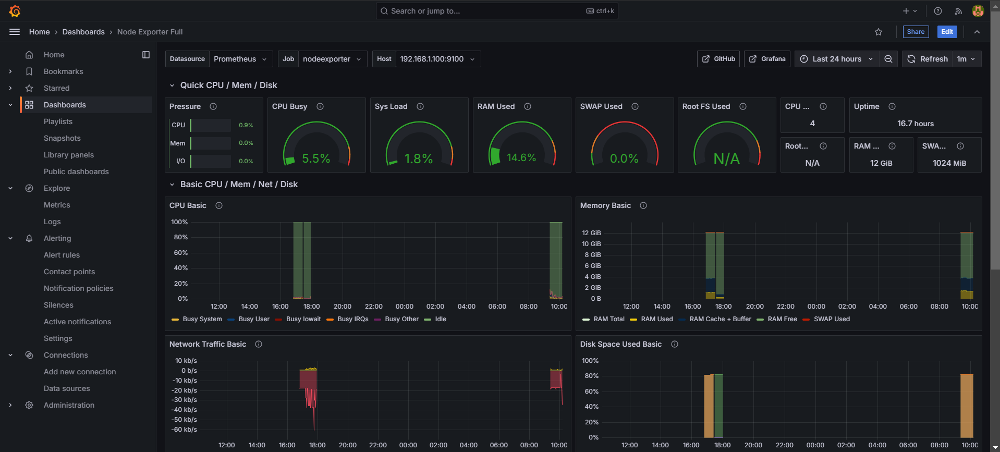

# Stack-Monitoring-Project
Projet de Stack Monitoring avec Prometheus, Grafana et Traefik.

## Étapes d'installation et de configuration

### 1. Clonage du répertoire GitHub
Clonez le projet à partir du dépôt suivant :
```bash
git clone https://github.com/stefanprodan/dockprom.git
```

---

### 2. Installation des exportateurs sur les machines cibles
Configurez les outils **Node Exporter** et **cAdvisor** pour collecter les métriques des machines cibles.

#### - Node Exporter :
```bash
docker run -d -p 9100:9100 --name=node_exporter --privileged prom/node-exporter
```

#### - cAdvisor :
```bash
docker run -d -p 8000:8080 --name=cadvisor --privileged gcr.io/cadvisor/cadvisor
```

#### - Pushgateway :
```bash
docker run -d -p 9091:9091 --name=pushgateway --privileged prom/pushgateway
```

---

### 3. Ajout des cibles dans Prometheus
Ajoutez les cibles dans le fichier de configuration de Prometheus pour superviser les métriques collectées.

#### Ouvrez le fichier de configuration :
```bash
sudo nano prometheus/prometheus.yml
```

#### Ajoutez les cibles :
```yaml
scrape_configs:
  - job_name: 'exportateurs'  # Peut être node_exporter, cAdvisor ou pushgateway
    scrape_interval: 5s      # Intervalle entre chaque collecte des métriques
    static_configs:
      - targets:             # Liste des cibles
        - "ip:port"          # Adresse IP et port de la machine à superviser
```

---

### 4. Vérification de la collecte des métriques
#### - Démarrez les conteneurs :
```bash
docker-compose up -d
```

#### - Accédez au service Prometheus :
Ouvrez votre navigateur et rendez-vous à l'adresse suivante :  [http://localhost:9090](http://localhost:9090)

<div align="center">
  
</div>

---

### 5. Ajout de Prometheus comme source de données pour Grafana
#### - Accédez à Grafana :
Ouvrez votre navigateur et rendez-vous à l'adresse suivante :  [http://localhost:3000](http://localhost:3000)

#### - Ajouter Prometheus comme source de données :
1. Naviguez vers **Data Sources → Add Data Source**.  
2. Cherchez **Prometheus** dans la liste.  
<div align="center">
  
</div>


3. Dans la section **Connection**, ajoutez l'URL du serveur Prometheus :  `http://localhost:9090`.
4. Enregistrez les modifications.

---

### 6. Implémentation des tableaux de bord dans Grafana
1. Naviguez vers **Dashboards → New → Import →** Choisissez un tableau de bord.  

#### Remarque :
Vous pouvez ajouter les tableaux de bord de deux manières :
- En ajoutant un fichier JSON correspondant au tableau de bord.
- En utilisant l'ID approprié du tableau de bord directement :
  - Pour les machines : **1860**
  - Pour les conteneurs : **11600**

2. Choisissez la source de données : **Prometheus**.

<div align="center">
  
</div>

---


