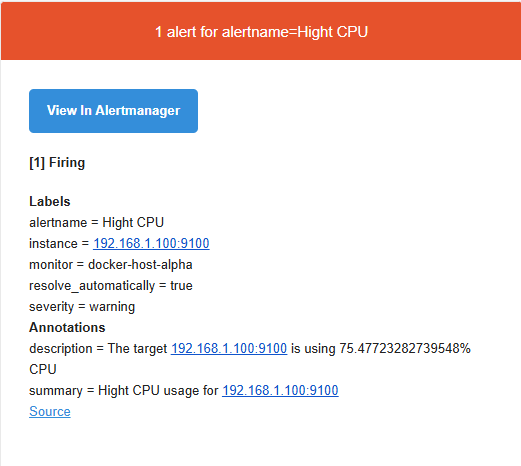

# Stack-Monitoring-Project
Projet de Stack Monitoring avec Prometheus, Grafana et Traefik.

## Étapes d'installation et de configuration

### 1. Clonage du répertoire GitHub
Clonez le projet à partir du dépôt suivant :
```bash
git clone https://github.com/stefanprodan/dockprom.git
```

---

### 2. Installation des exportateurs sur les machines cibles
Configurez les outils **Node Exporter** et **cAdvisor** pour collecter les métriques des machines cibles.

#### - Node Exporter :
```bash
docker run -d -p 9100:9100 --name=node_exporter --privileged prom/node-exporter
```

#### - cAdvisor :
```bash
docker run -d -p 8000:8080 --name=cadvisor --privileged gcr.io/cadvisor/cadvisor
```

#### - Pushgateway :
```bash
docker run -d -p 9091:9091 --name=pushgateway --privileged prom/pushgateway
```

---

### 3. Ajout des cibles dans Prometheus
Ajoutez les cibles dans le fichier de configuration de Prometheus pour superviser les métriques collectées.

#### Ouvrez le fichier de configuration :
```bash
sudo nano prometheus/prometheus.yml
```

#### Ajoutez les cibles :
```yaml
scrape_configs:
  - job_name: 'exportateurs'  # Peut être node_exporter, cAdvisor ou pushgateway
    scrape_interval: 5s      # Intervalle entre chaque collecte des métriques
    static_configs:
      - targets:             # Liste des cibles
        - "ip:port"          # Adresse IP et port de la machine à superviser
```

---

### 4. Vérification de la collecte des métriques
#### - Démarrez les conteneurs :
```bash
docker-compose up -d
```

#### - Accédez au service Prometheus :
Ouvrez votre navigateur et rendez-vous à l'adresse suivante :  [http://localhost:9090](http://localhost:9090)

<div align="center">
  
</div>

---

### 5. Ajout de Prometheus comme source de données pour Grafana
#### - Accédez à Grafana :
Ouvrez votre navigateur et rendez-vous à l'adresse suivante :  [http://localhost:3000](http://localhost:3000)

#### - Ajouter Prometheus comme source de données :
1. Naviguez vers **Data Sources → Add Data Source**.  
2. Cherchez **Prometheus** dans la liste.  
<div align="center">
  
</div>


3. Dans la section **Connection**, ajoutez l'URL du serveur Prometheus :  `http://localhost:9090`.
4. Enregistrez les modifications.

---

### 6. Implémentation des tableaux de bord dans Grafana
1. Naviguez vers **Dashboards → New → Import →** Choisissez un tableau de bord.  

#### Remarque :
Vous pouvez ajouter les tableaux de bord de deux manières :
- En ajoutant un fichier JSON correspondant au tableau de bord.
- En utilisant l'ID approprié du tableau de bord directement :
  - Pour les machines : **1860**
  - Pour les conteneurs : **11600**

2. Choisissez la source de données : **Prometheus**.

<div align="center">
  
</div>

---

### 7. Création des alertes :
#### Créez le fichier d'alertes :
```bash
sudo nano prometheus/alerts.yml
```
#### Ajoutez les alertes :
```yaml
groups:    # Définir un groupe d'alertes 
  - name: node_alerts    # Nom du groupe d'alertes  
    rules:  
      - alert: Hight CPU    # Nom de l'alerte
        expr: 100 - (avg(rate(node_cpu_seconds_total{mode="idle"}[1m])) by (instance)) * 100 > 70    # Condition d'alerte
        for: 1m    # Délai avant de considérer l'alerte active
        labels:
          severity: warning    # Niveau de gravité de l'alerte
          resolve_automatically: true    # Automatisation de la résolution de l'alerte
        annotations:    # Informations supplémentaires pour l'alerte
          summary: Hight CPU usage for  {{ $labels.instance }}
          description: The target {{ $labels.instance }} is using {{ $value }}% CPU
```
### Liez le fichier d'alertes dans le fichier de configuration principal :
Ajoutez cette ligne dans `prometheus.yml` :

```yaml
rule_files:
  - "alerts.yml"
```
### Redémarrez Prometheus pour appliquer les changements :
```yaml
docker-compose restart prometheus
```

<div align="center">
  
</div>

### 8. Configuration de alert manager pour l'envoi des Emails:
#### Ouvrir le fichier de configuration :
```bash
nano alertmanager/config.yml
```
#### Ajoutez la configuration :
```yaml
global:
  smtp_smarthost: 'smtp.gmail.com:587'    # Le serveur SMTP utilisé
  smtp_from: 'exemple@gmail.com'    # L'adresse email de l'expéditeur
  smtp_auth_username: 'username'    # Le nom d'utilisateur
  smtp_auth_password: 'password'    # Le mot de passe pour l'authentification SMTP (configurer dans la prochaine partie)
  smtp_require_tls: true    # Sécuriser la connexion

route:
  group_by: ['alertname']    # La methode de groupement des alertes
  group_wait: 30s    # Le temps d'attente avant d'envoyer la première alerte groupée
  group_interval: 5m    # L'intervalle entre les envois d'alertes groupées
  repeat_interval: 1h    # L'intervalle de répétition des alertes
  receiver: "email-alert"    # Le nom du récepteur des alertes

receivers:
  - name: "email-alert"
    email_configs:
      - to: "exemple@gmail.com"    # L'adresse email du destinataire
```
### Générer un mot de passe d'application pour `smtp_auth_password`:
  - Connectez-vous à votre compte Google.
  - Accédez à Sécurité.
  - Sous "Validation en deux étapes", sélectionnez "Mots de passe d'application" (Validation en deux étapes doit être activé).
  - Suivez les instructions pour générer un mot de passe d'application.

<div align="center">
  
</div><br>

  - Utilisez ce mot de passe dans votre configuration Alertmanager.
### Recevoir des alertes par mail :
<div align="center">
  
</div>
